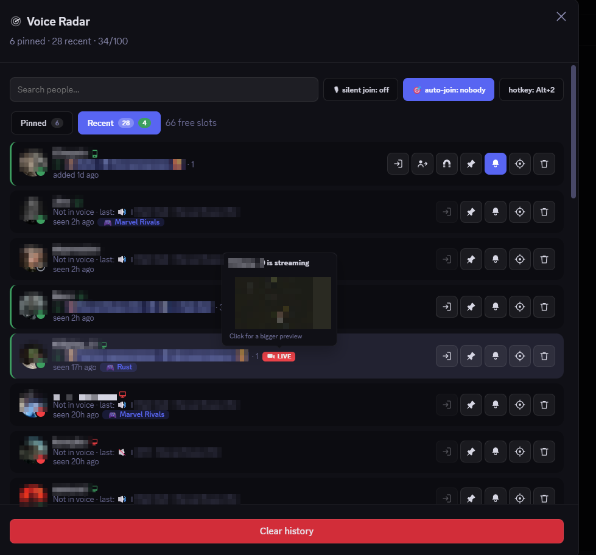
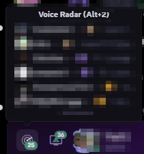
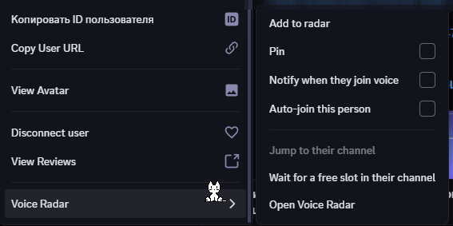

# VoiceRadar-Discord

Vencord plugin. Remembers everyone you shared a voice channel with and shows where they are now.

## Features

- **List.** Everyone you met in voice, newest first, up to the limit (15 by default). Anything you
  switched on by hand keeps its slot: a pin, a bell, the auto-join target, the magnet, and people you
  added yourself.
- **Two tabs.** Pinned and Recent, each with its own count plus a green one for who is in voice right
  now. Pinned rows drag into any order.
- **Per row.** Channel, server, headcount, status, activity chip, mic, headphones, camera, when you
  last sat together, and one icon per device the person is online from.
- **Join.** A button on every row and in the right-click menu. Padlock on channels you cannot enter,
  a queue on full ones, and hidden channels still name their members on hover.
- **Silent join** (off by default). Joins the plugin makes start with your mic off.
- **Auto-join.** Pick one person and you follow them, including into a full channel once a slot
  opens, and the wait moves with them. Walking out of their channel, or out of voice altogether,
  leaves that channel alone until they move somewhere else. Somebody else disconnecting you or moving
  you out is undone instead, up to six times a minute.
- **Queue.** Holds your place in a full channel until you get in or cancel.
- **Notifications.** A bell per person, naming the channel. Several joins collapse into one. A click
  opens their row and brings Discord forward. A sound goes with it, which is what reaches you over a
  fullscreen game, where Windows swallows the notification itself.
- **Stream preview.** `LIVE` badge, thumbnail on hover, full size on click.
- **Search.** Nickname, display name or username, plus a chip for whoever is in voice this second.
- **Hotkey.** `Alt+2` opens and closes the window. Rebindable, and claimable system wide.
- **Moderator mode** (off by default). Pull one person or a whole channel to you (99 per click,
  confirmation past eight, four moves at a time by default), undo a pull, magnet one person back each
  time they leave. Needs Move Members in both channels of the same server.
- **UI.** Account panel button with a counter, submenu in user menus and profiles, entry in voice and
  stage channel menus.
- **Languages.** English and Russian, following Discord by default.

## Install

Needs a [Vencord dev install](https://docs.vencord.dev/installing/). From the root of that checkout:

```bash
git clone https://github.com/MrTopQ/VoiceRadar-Discord src/userplugins/VoiceRadar-Discord
```

```bash
pnpm build && pnpm inject
```

`pnpm inject` only the first time. Restart Discord, then enable **VoiceRadar-Discord** in Vencord
settings, Plugins. Without git, download the ZIP into `src/userplugins/` by hand.

## Settings

Eighteen, in panel order. Vencord prints a longer description beside each.

| Setting | Control | Default | What it does |
|---|---|---|---|
| Language | dropdown | Auto | Auto (follow Discord), English, Русский |
| People the list keeps | slider, 5 to 100 | 15 | Pinned people take slots too |
| Hotkey | text | `Alt+2` | Opens and closes the window |
| Silent join | switch | off | Mutes your mic on every join the plugin makes |
| Auto-join | switch | on | You follow your target, waiting for a slot when needed |
| Only follow when idle | switch | off | Never pulls you out of a call |
| Auto-join cooldown | seconds | 5 | Gap between two auto-joins, clamped to 2s and 5min |
| Notification style | dropdown | Notification | Corner notification, Toast, or Both |
| Join sound | dropdown | Discord join blip | Also the Discord ping, the plugin's own chime, or off. Heard over a fullscreen game |
| Join sound volume | slider, 0 to 100 | 60 | How loud that sound is |
| Queue for full channels | switch | on | Auto-join only. Queueing by hand works either way |
| Track automatically | switch | on | Remembers everyone you share a voice channel with |
| Servers watched for voice | slider, 10 to 200 | 100 | Discord only sends voice states for subscribed servers, so joins past this number go unseen. Your people's servers come first, and the window says how many did not fit |
| Keep timers awake | switch | on | Holds Discord's timers at normal pace in the background, so a join reaches you in seconds instead of minutes |
| Group move speed | dropdown | Fast | Careful sends one move at a time, Fast four, Instant eight. Every move is a line in the server's audit log |
| Moderator mode | switch | off | Adds pull, undo and magnet where you hold Move Members |
| Panel button | switch | on | Goes away at once, needs a restart to come back |
| Hotkey system wide | switch | off | The hotkey fires while Discord sits in the background and brings it up. Needs a full restart |

## Notes

- The list stays on your machine, in IndexedDB through Vencord's DataStore. The plugin talks to
  Discord and to nothing else.
- One auto-join target or one magnet at a time. Arming either disarms the other and drops your queue.
- Requests go through the client's own REST and gateway paths, spaced out: names 250ms apart,
  statuses in one batch of up to 100 people, one server subscription every 1.2s, and group moves at
  the pace you pick. A rate limit waits itself out once, and the magnet stops after ten returns in a
  minute.
- The status chip opens a page listing every feature, the Discord internals behind it and whether
  they still sit where the plugin expects, plus how much of Discord's voice picture the client holds.
- The panel button coexists with other plugins that add buttons there.

## License

GPL-3.0. See [LICENSE](LICENSE).

## Screenshots






